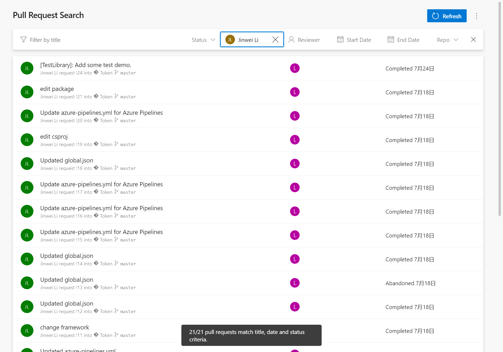

Allows pull requests to be filtered by status, creator, reviewer, title, start date, end date, and repository.

By default extension searches all pull requests in all repositories.

# Change Log

### 2.0.131 (10/15/2021)

Rewrite most of UI, removed PR content search.

Support passing filter values via HTTP request query parameters.

Based on [ostreifel's extension](https://marketplace.visualstudio.com/items?itemName=ottostreifel.pull-request-search).
